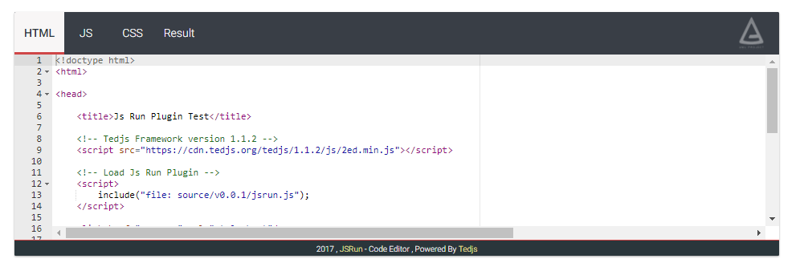
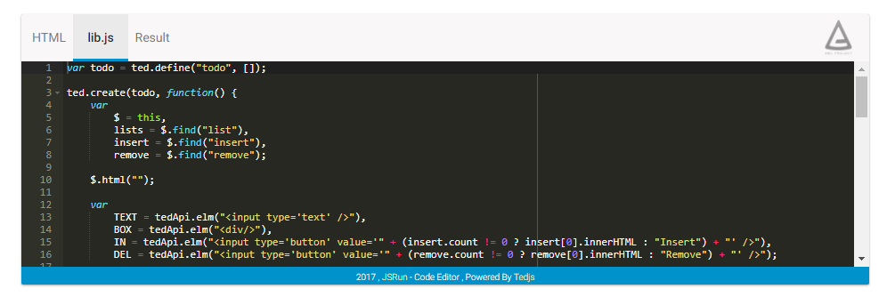

# JsRun - Tedjs Library

## Guidance Language:
* [English](#-language-english)
* [فارسی](#-language-پارسی)

### :: Name Space and ID
NameSpace | ID
--------- | ----------
JsRun | system.aml.jsrun

##

# .:: Language: **English**

### :: Description:

jsRun is a plugin for Tedjs Framework. it help you to create a code editor (Playground) in your site directly. you can define a file as a library and access to it from ajax with a file name , like a local file. it has JS,HTML and CSS with other external files that you can add to it.
each external file can be edited in editor or just be a external library.
editor has two color. dark and light.
it support your own code parser to pre parse the codes.create your language front-end playground.

### :: Element Details
* General Shape:
    ```html
    <jsrun></jsrun>
    ```
    the general element TagName is ``jsrun`` that get 3 attribute and some children elements.

    to include this library to your project after attaching [tedjs](https://tedjs.org) to your website , write this function down:
    ```javascript
    include("system.aml.jsrun");
    // OR
    ainclude("system.aml.jsrun");
    ```
    or you can download it and use it localy.

*  Attributes:

    * ``width`` : 

        to set the width of whole editor. accepts all css units. the default unit is ``px``
        ```html
        <jsrun width="50%"></jsrun>
        ```

    * ``height`` : 
    
        to set the height of whole editor. accepts all css units.the default unit is ``px``
        ```html
        <jsrun height="200px"></jsrun>
        ```
    * ``color`` :

        with this can set the color of your editor.``light`` and ``dark``
        
        ```html
        <jsrun color="dark"></jsrun>
        ```
        OR
        
        ```html
        <jsrun color="light"></jsrun>
        ```
* Children ``Elements`` :

    * General ``Attributes`` :

        each child element has generals attributes.

        * ``type`` Attribute : **``Requeired``**

            ``type`` attribute will set the type of that element to parse the content. types are ``html`` , ``js`` or ``javascript`` and ``css``
            ```html
            <element type="html"/>
            <element type="js"/>
            <element type="css"/>
            ```
        
        * ``url`` Attribute :

            if use this attribute , the inner content of element will not parse as a code inside the editor and the content of the url will be fetched.
            ```html
            <element url="/path/file.ext">
            <element url="http://doamin.tld/...">
            ```

        * ``preCompile`` Attribute :

            in some cases you want to use ``less`` instead of ``css`` . so you can load less as a library in your site and use the parse function as a pre parser for the codes to load them as ``css``.

            in attribute value must write down the name of parser function. like:
            ```html
            <element preCompile="less.parser">
            ```

    * ``lang`` Element

        the element ``lang`` will let you to insert any type of ``css`` , ``javascrip`` and ``html`` for one time. if there are more than one element of a same type , the first one will accepted.
        
        to define a ``lang`` element , you must do like this:
        ```html
        <lang type="[Types]"></lang>
        ```

        if you write codes inside the element block , it will parse the code , but if use the ``url`` attribute it will fetch the url data and parse this data.
        ```html
        <lang type="javascript">var a = 2;</lang>
        // OR
        <lang type="css" url="http://domain.com/file.css"></lang>
        ```

        and as on top explained you can use ``preCompile`` attribute too.

    * ``extfile`` Element :

        this element is an external file that you can load a url or inline code as a editable library in editor or not.

       it accept general attributes , also has some special attributes too.

       to define the element:
       ```html
       <extfile 
            name="library"
            path="lib.js"
            path-in="[Type | Types,...]"
       ></extfile>
       ```

       * ``extFile`` element attributes :
            * ``name`` Attribute :

                the value of this attribute is used to write in the top menu of editor to can be accessible to edit.
                
                if the name not defined , the name will be selectd automaticly.the name will be ``Extend[Number]`` like ``Extend0``.

            * ``path`` Attribute :

                if use this attribute , the system will show this as an editable library in editor. the value of this attribute is a file name with its extension name like ``app.js``.

                after adding this , you can access to this file via ajax with the defined file name. like it is a local file.

            * ``path-in`` Attribute :

                with this , you can tell element that the file name should be accessible within which files. ``html`` , ``css`` or ``javascript`` or multiple of them.

                **Notice**: at this time , because the url is converting to local , it is accessible in javascript
                ```html
                <extfile ... path-in="html"></extfile>
                ```
                OR
                ```html
                <extfile ... path-in="javascript,css"></extfile>
                ```
                OR ...


# Notice
    to write html code inside lang element , you must encode it first to not be parsed by Browser 

##

# Example :

the ``lang`` and ``extfile`` elements are optional. if don't write each one , will not shown on top menu.

```html
<jsrun color="light" width="800px" height="300px">

    <lang type="html">
        &lt;p&gt; Hello This is a Test &lt;/p&gt;
    </lang>
    
    <lang type="css">body{
        background:black;
        color:white;
    }</lang>

    <lang type="js" preCompile="run">
        2
    </lang>

    <extfile type="js">
        var a = 2;
    </extfile>

    <extfile type="css" path="style.css" name="Style">
        body{color:red !important;}
    </extfile>

</jsrun>

<script>
    function run(data) {
        return "alert("+data+")";
    }
</script>
```


##

# .:: Language: **پارسی**

### :: توضیحات :

جی اس ران یک پلاگین برای فریم ورک تد جی اس می باشد. به شما کمک می کند تا یک تدوین گر کد در وبسایت خود به صورت مستقیم ایجاد کنید. می توانید یک فایل را به عنوان کتابخانه تعریف کنید و از طریق در خواست ای جکس به آن دسترسی داشته باشید. مانند یک فایل لوکال . فایل های اچ تی ام ال ، سی اس اس و جاوا اسکریپت و همچنین فایل های خارجی دیگر را می تواند نمایش داده و یا اجرا کند.
تدوین گر دارای دو رنگ روشن و تاریک می باشد.

### :: جزئیات عنصر
* شکل کلی:
    ```html
    <jsrun></jsrun>
    ```
    نام تگ عنصر 

    ``jsrun`` 

    می باشد  که 3 اتریبیوت ب همراه چندین فرضد دریافت می کند.

    برای اضافه کردن این کتابخانه به پروژه خود ، می بایست ابتدا فریم ورک [تد جی اس](https://tedjs.org) را به وبسایت خود الصاق نمایید و سپس از کد زیر برای وارد سازی استفاده نمایید:

    ```javascript
    include("system.aml.jsrun");
    // OR
    ainclude("system.aml.jsrun");
    ```
    و یا می توانید پلاگین را دانلود کرده و در وبسایت خود بارگذاری نمایید.

*  اتریبیوت ها:

    * ``width`` : 

        می توان عرض ادیتور را مشخص کرد. تمامی واحد های موجود در سی اس اس را پشتیبانی می کند. درصورت وارد کردن عدد به تنهایی ، واحد پیشفرض ، پیکسل در نظر گرفته خواهد شد.
        ```html
        <jsrun width="50%"></jsrun>
        ```

    * ``height`` : 
    
        می توان ارتفاع ادیتور را مشخص کرد. تمامی واحد های موجود در سی اس اس را پشتیبانی می کند. درصورت وارد کردن عدد به تنهایی ، واحد پیشفرض ، پیکسل در نظر گرفته خواهد شد.
        ```html
        <jsrun height="200px"></jsrun>
        ```
    * ``color`` :

        می توان قالب ادیتور را مشخص نمود.
        
        ```html
        <jsrun color="dark"></jsrun>
        ```
        یا
        
        ```html
        <jsrun color="light"></jsrun>
        ```
* ``عناصر`` فرزند :

    * ``اتریبیوت های`` عمومی :

        همه ی عناصر فرزند دارای تعدادی اتریبیوت عمومی هستند:

        * ``type`` : **``الزمامی``**

            وظیفه این اتریبیوت ، مشخص کردن فرمت کد برای پارس کردن آن می باشد.
            تایپ های مجاز 

            ``html`` , ``js`` or ``javascript`` , ``css``
            ```html
            <element type="html"/>
            <element type="js"/>
            <element type="css"/>
            ```
        
        * ``url`` :

            درصورت استفاده از این اتریبیوت ، محتوای درونی عنصر ، پارس نخواهد شد و در عوض محتوای آدرس داده شده گرفته شده و پارس می شود.

            ```html
            <element url="/path/file.ext">
            <element url="http://doamin.tld/...">
            ```

        * ``preCompile`` :

            در برخی موارد برنامه نویس می خواهد به جای استفاده از سی اس اس ، از لِس استفاده کند بنابر این ، کتابخانه لس را الصاق می نماید و نام تابع پارسر آن را در این اتریبیوت می نویسد. سیستم قبل از اجرا کد را به تابع ارسال می کند و مقدار خروجی را نمایش می دهد.

            در مقدار اتریبیوت می بایست نام تابع نوشته شود . مانند:
            ```html
            <element preCompile="less.parser">
            ```

    * ``lang`` عنصر

        این عنصر اجازه می دهد تا کد های ``اچ تی ام ال`` ، ``سی اس اس`` و ``جاوا اسکریپت`` را برای یک بار وارد نمایید. درصورت ورجود تعداد بیشتر ، اولین درنظر گرفته می شود.
        
        برای تعریف می بایست مانند زیر عمل نمایید:
        ```html
        <lang type="[Types]"></lang>
        ```

        مانند بالا این عنصر دارای اتریبیوت های عمومی می باشد.

    * ``extfile`` عنصر :

        این عنصر به عنوان یک فایل خارجی عمل می کند که می تواند داده درونش و یا داده آدرس داده شده را به عنوان یکی کتابخانه تدوین پذیر و یا به صورت مستقیم اجرا پذیر اجرا کند.

       این عنصر نیز اتریبیوت های عمومی را داراست و نیز دارای اتریبیوت های خاص نیز می باشد.

      برای تعریف این عنصر:
       ```html
       <extfile 
            name="library"
            path="lib.js"
            path-in="[Type | Types,...]"
       ></extfile>
       ```

       * ``extFile`` اتریبیوت های عنصر :
            * ``name`` :

                مقدار این اتریبیوت برای نمایش در منوی بالای ادیتور استفاده می شود تا بتوان به کد برای ادیت دسترسی داشت

                درصورتی که نام مشخص نشده باشد ، نام به صورت خودکار انتخاب می شود. فرمت نام به صورت زیر می باشد:

                ``Extend[Number]`` مانند ``Extend0``

            * ``path`` :

                درصورت استفاده از این اتریبیوت ، سیستم ، این کتابخانه را در ادیتور نمایش خواهد داد. مقدار این اتریبیوت ، نام فایل همراه با نوع فایل می باشد. مانند:

                ``app.js``

                پس از اضافه کردن این اتریبیوت می توانید از طریق ای جکس توسط نام فایل تعریف شده به محتوای فایل دسترسی داشته باشید. مانند یک فایل لوکال.

            * ``path-in`` :

                از طریق این اتریبیوت می توانید به سیستم بگویید که فایل تعریف شده در اتریبیوت قبل در کدام کد ها قابل دسترسی می باشد.مقدار های مجاز هر یک از موارد زیر یا ترکیبی از آن ها می باشد.

                ``html`` , ``css`` , ``javascript``

                به دلیل اینکه آدرس به صورت لوکال تبدیل می شود فعلا تنها در فایل های جاوا اسکریپت در دسترس می باشد.

                ```html
                <extfile ... path-in="html"></extfile>
                ```

                یا

                ```html
                <extfile ... path-in="javascript,css"></extfile>
                ```

                یا ...


# Notice
    برای نوشتن کدهای اچ تی ام ال ، به دلیل اینکه توسط مرورگر تجزیه و یا پارس نشود ، به صورت انکد شده بنویسید.

##

# Example :

عناصر 

``lang`` و ``extfile``

عناصر اختیاری می باشند. درصورتی که هرکدام نوشته نشوند در ادیتور نمایش داده نخواهند شد.

```html
<jsrun color="light" width="800px" height="300px">

    <lang type="html">
        &lt;p&gt; Hello This is a Test &lt;/p&gt;
    </lang>
    
    <lang type="css">body{
        background:black;
        color:white;
    }</lang>

    <lang type="js" preCompile="run">
        2
    </lang>

    <extfile type="js">
        var a = 2;
    </extfile>

    <extfile type="css" path="style.css" name="Style">
        body{color:red !important;}
    </extfile>

</jsrun>

<script>
    function run(data) {
        return "alert("+data+")";
    }
</script>
```

##

## to highlighting the code , [ace editor](https://github.com/ajaxorg/ace) is used. 

# Author
this is created by [poryagrand](https://github.com/poryagrand) . Powered by [Tedjs](https://tedjs.org)
